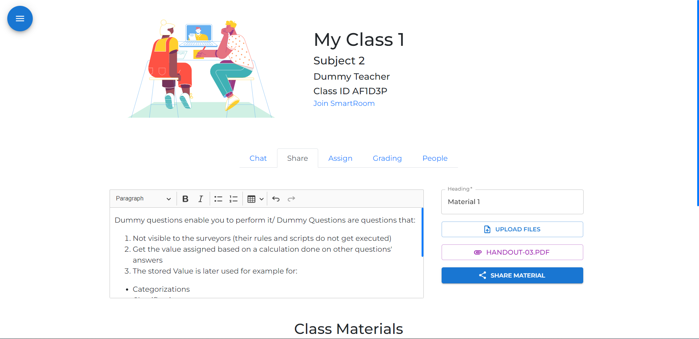

<h1>SmartClass</h1>

#### SmartClass - Online Teaching Platform Based ReactJs and Firebase - Code Mergers
#### __Motive:__ Empowering Education
__Timeline:__ July 2021 - May 2022

- SmartClass is classroom generating web application which helps users to develope classroom as required and have an ecstatic classroom experienced. It is also equipped with inbuilt video rooms which can not be found in conventional classroom applications.
- Fully secured classrooms with authentic sharable classroom keys. Fully functional chatting system with embedded url and text formatting support for each classroom. Smart Video Rooms for each class which can directly be accessed by both teachers and students.
- As a teacher you can invite students, share materials, create assignments, conduct quizzes, arrange meetings, chat with students and a lot more. You can also get all information regarding your activities.
- As s student you can access shared materials, chat with friends and teachers, submit your work, attend online classes(video calling)and quizzes. You can also get all information regarding your activities.',

## Deployed Features

### `Landing Page`: Welcome Page

### `Authentication`: Email Authentication, Password Hashing, Password Updation, Sigh Up, SignIn

#### Sigh Up

#### SignIn

### `Users Profile`: Password Updation, Activity Logs

### `Class Functionality`: Class Creation, Class Joining, Class Chat, Share Materials, Class Materials, Class Upcomings, Peopls

#### Create Class

#### Join Class

#### Class Chat

#### Share Materials

#### Class Materials

#### Class Upcomings

#### People

### `Assignment`: Assigning Assignments, Text Formatting, Assignment Submission
#### Assignment Creation

#### Assignment Submission Status

### `Quiz`: Conduct Quiz, Quiz Page
#### Quiz Creation

#### Quiz Page

#### Quiz Grading

### `Virtual Rooms`: Video Calling Rooms(Max 200 Participant), Screen Share, Audio Features

## Deployment
- Visit [SmartClass](https://smartclass.netlify.app/)
- Visit SmartClass [GitHub Repo(Public)](https://github.com/Code-Mergers/SmartClass)

## Development Team [Code-Mergers](https://code-mergers-org.netlify.app/)

| Name | Roll(KIIT-DU) |
| ----- | ----- |
| Abhiraj Chatterjee | 1905003 |
| Yash Mishra | 1905073 |
| Kankana Dolai | 1905324 |
| Sayan Bhattacharyya(Leader) | 1905345 |

## Resource
- [FAG](https://smartclass.netlify.app/info/FAQs)
- [Tutorials](https://smartclass.netlify.app/info/Tutorials)

### Thank you for visiting
