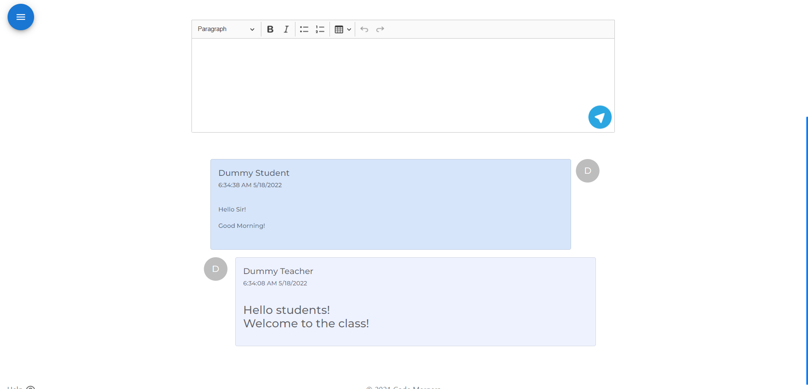

# SmartClass

<div align='center'>
        

<h2> SmartClass - Empowering Education </h2>
</div>

#### Online Teaching Platform Based ReactJs and Firebase

## Deployed Site
- Visit [SmartClass](https://smartclass.netlify.app/)

## Deployed Features
- `Authentication`: Email Authentication, Password Hashing, Password Updation
<!--  -->

- `Users Profile`: Managing Information, Updation, Activity Logs
<!--  -->
<!--  -->

- `Class Functionality`: Class Creation, Class Manipulation,Student Participation, Sharing Material, Assigning Tasks
<!--  -->
<!--  -->
<!--  -->

- `Material`: Sharing
<!--  -->
<!--  -->

- `Chatting`: Class chats
<!--  -->

- `Assignment` Assigning Assignments, Text Formatting
<!--  -->

- `Virtual Rooms`: Video Calling Rooms(Max 200 Participant), Screen Share, Audio Features
<!--  -->


### Designed and Developed by Team [Code-Mergers](https://code-mergers-org.netlify.app/)


[](https://github.com/Sayan3990)
[](https://github.com/Abhiraj3112000)
[](https://github.com/usagi24)
[](https://github.com/Yash15-maker)


### Line Count
Latest Update: `28/01/2022`

```sh

-------------------------------------------------------------------------------
Language                     files          blank        comment           code
-------------------------------------------------------------------------------
Javascript                      22            200            143           1550
CSS                              6             89             11            709
HTML                             2              1              1            264
-------------------------------------------------------------------------------
SUM:                            30            290            155           2523
-------------------------------------------------------------------------------

```

#### Thank you for visiting
